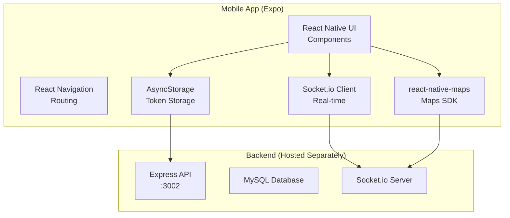

# Expo App Conversion Plan - Swyft Rideshare Application

## Project Overview

This document outlines the comprehensive plan to convert the existing Swyft React web application into a native mobile application using Expo (React Native) for deployment to the Apple App Store and Google Play Store.

### Current Technology Stack

| Layer | Technology |
|-------|------------|
| Frontend | React 19 + React DOM |
| UI Framework | Material-UI (MUI) v7 |
| Maps | Google Maps API + Leaflet |
| Routing | React Router DOM |
| Backend | Express.js (Node.js) |
| Database | MySQL |
| Real-time | Socket.io |
| Authentication | JWT |

---

## Conversion Architecture



---

## Key Changes Required

### 1. Dependencies Replacement

| Original (Web) | Replacement (Expo/React Native) | Notes |
|----------------|--------------------------------|-------|
| `react-dom` | `react-native` | Core React Native package |
| `react-router-dom` | `@react-navigation/native` + `@react-navigation/native-stack` | Navigation |
| `@mui/material` | `react-native-paper` or custom components | UI components |
| `leaflet` + `react-leaflet` | `react-native-maps` | Maps (uses native SDK) |
| `@react-google-maps/api` | `react-native-maps` | Unified solution |
| `sessionStorage` | `@react-native-async-storage/async-storage` | Persistent storage |

### 2. Keep Compatible Packages

These packages work in both web and React Native:
- `axios` - HTTP client
- `socket.io-client` - Real-time communication
- `jsonwebtoken` - Token handling
- `jwt-decode` - Token decoding

### 3. Backend Considerations

The Express backend **cannot be bundled** in the mobile app. Options:
- **Option A**: Host backend on a cloud service (Render, Railway, Heroku, AWS)
- **Option B**: Keep localhost for development, deploy to cloud for production

---

## Implementation Steps

### Phase 1: Project Setup

- [ ] Initialize new Expo project (`npx create-expo-app@latest swyft-mobile`)
- [ ] Install required dependencies
- [ ] Configure app.json for iOS/Android
- [ ] Set up project folder structure

### Phase 2: Core Infrastructure

- [ ] Configure React Navigation
- [ ] Set up AsyncStorage for auth tokens
- [ ] Implement API service layer (axios)
- [ ] Implement Socket.io service
- [ ] Configure environment variables

### Phase 3: Authentication

- [ ] Create SignIn screen
- [ ] Create registration screen
- [ ] Implement token storage/retrieval
- [ ] Handle session persistence

### Phase 4: Passenger Features

- [ ] Implement passenger dashboard
- [ ] Create ride booking flow
- [ ] Implement map with location picker
- [ ] Real-time driver tracking
- [ ] Ride history display

### Phase 5: Driver Features

- [ ] Implement driver dashboard
- [ ] Ride request notifications
- [ ] Accept/decline ride flow
- [ ] Driver location broadcasting
- [ ] Ride status updates

### Phase 6: Maps Integration

- [ ] Install and configure `react-native-maps`
- [ ] Implement Google Maps for Android
- [ ] Implement Apple Maps for iOS
- [ ] Add location autocomplete (reverse geocoding)
- [ ] Route display between pickup/dropoff

### Phase 7: Platform-Specific Configuration

- [ ] Configure iOS (Apple Developer account, Bundle ID)
- [ ] Configure Android (Google Play Console, package name)
- [ ] Add required permissions (location, camera, etc.)
- [ ] Generate signing certificates

### Phase 8: Build & Deploy

- [ ] Build iOS (.ipa) for App Store
- [ ] Build Android (.aab/.apk) for Play Store
- [ ] Test on physical devices
- [ ] Submit to App Store
- [ ] Submit to Play Store

---

## File Structure (Target)

```
swyft-mobile/
├── App.js                    # Root component with navigation
├── app.json                  # Expo configuration
├── src/
│   ├── components/           # Reusable UI components
│   │   ├── Button.js
│   │   ├── Input.js
│   │   ├── Card.js
│   │   └── MapMarker.js
│   ├── screens/              # Screen components
│   │   ├── SignInScreen.js
│   │   ├── RegisterScreen.js
│   │   ├── PassengerDashboard.js
│   │   ├── DriverDashboard.js
│   │   ├── RideBookingScreen.js
│   │   └── RideHistoryScreen.js
│   ├── services/             # API and socket services
│   │   ├── api.js
│   │   ├── socket.js
│   │   └── auth.js
│   ├── navigation/           # Navigation configuration
│   │   └── AppNavigator.js
│   ├── constants/            # App constants
│   │   ├── colors.js
│   │   ├── config.js
│   │   └── theme.js
│   └── utils/                # Utility functions
│       └── location.js
├── android/                  # Android native code
├── ios/                      # iOS native code
└── node_modules/
```

---

## Critical Decisions Required

### 1. Maps Provider
- **Option A**: Use `react-native-maps` with Google Maps (requires Google Maps API key, works on both platforms)
- **Option B**: Use Apple Maps on iOS, Google Maps on Android (no extra cost for iOS)
- Decision needed: Which approach?

### 2. UI Framework
- **Option A**: `react-native-paper` (Material Design, similar to current MUI)
- **Option B**: Build custom components (more work, smaller bundle)
- **Option C**: Use Expo's built-in components + custom styling
- Decision needed: Preferred UI approach?

### 3. Backend Hosting
- **Option A**: Deploy existing backend to cloud service
- **Option B**: Build new backend with Expo SDK
- Decision needed: How to handle backend?

### 4. Authentication Flow
- Keep existing JWT-based auth with minor modifications
- Add biometric authentication option (fingerprint/face)
- Decision needed: Authentication enhancements?

---

## Estimated Scope

This conversion involves:
- **New files**: ~40-60 files (screens, components, services)
- **Modified files**: Backend configuration
- **Dependencies**: ~20-30 new packages
- **Testing**: Full regression testing on iOS and Android
- **App Store submission**: Requires Apple Developer account ($99/year)
- **Play Store submission**: Requires Google Play Console ($25 one-time)

---

## Next Steps

1. Review and approve this plan
2. Decide on critical decisions above
3. Confirm backend hosting strategy
4. Switch to Code mode to begin implementation
